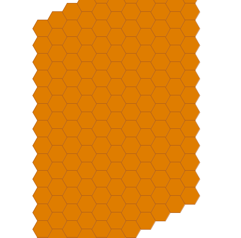
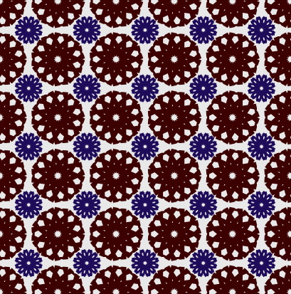

# Nodebox Art

I love art, geometry and coding. [Nodebox 3](https://www.nodebox.net/node/) combines all three and it's the most fun (visual) programming language. In this repo, you will find some of the art I have created using it. Enjoy!

## Showcase

| Project                  | Code Link                             | Preview                                        |
| ------------------------ | ------------------------------------- | ---------------------------------------------- |
| Honeycomb/Hexagonal Grid | [.ndbx](static/honeycomb-grid.ndbx)   |    |
| Eyes Blinking            | [.ndbx](animation/eyes-blinking.ndbx) |      |
| Tile Pattern no.1        | [.ndbx](animation/tile-pattern1.ndbx) |  |
| Waves                    | [.ndbx](animation/waves.ndbx)         |                      |